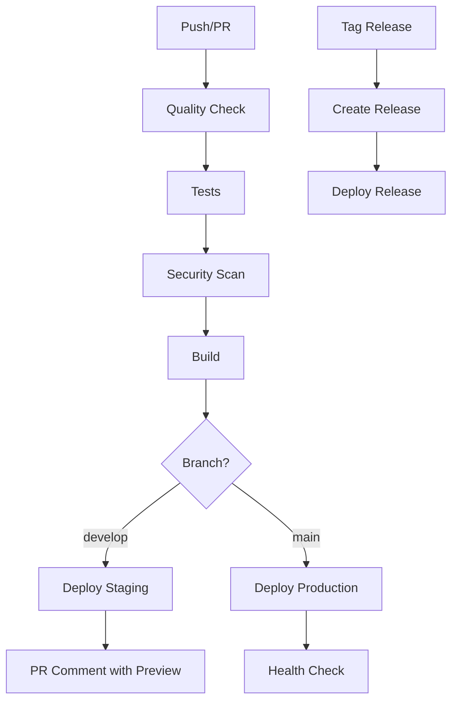

# 🚀 Resumo da Implementação CI/CD - Contabilease

## ✅ Implementação Concluída

### 📁 Arquivos Criados/Modificados

#### Workflows GitHub Actions
- ✅ `.github/workflows/ci.yml` - Pipeline principal (melhorado)
- ✅ `.github/workflows/deploy-staging.yml` - Deploy para staging
- ✅ `.github/workflows/deploy-production.yml` - Deploy para produção
- ✅ `.github/workflows/security-scan.yml` - Análise de segurança
- ✅ `.github/workflows/performance-test.yml` - Testes de performance
- ✅ `.github/workflows/release.yml` - Releases automatizadas
- ✅ `.github/workflows/quality-check.yml` - Verificações de qualidade (existente)

#### Configurações
- ✅ `lighthouse.config.js` - Configuração do Lighthouse CI
- ✅ `bundlesize.config.js` - Configuração de análise de bundle
- ✅ `scripts/ci-setup.sh` - Script de configuração (Linux/Mac)
- ✅ `scripts/ci-setup.ps1` - Script de configuração (Windows)

#### Documentação
- ✅ `CI_CD_SETUP.md` - Documentação completa do CI/CD
- ✅ `CI_CD_IMPLEMENTATION_SUMMARY.md` - Este resumo

## 🔧 Funcionalidades Implementadas

### 1. **Pipeline Principal (ci.yml)**
- ✅ Verificação de qualidade de código
- ✅ Execução de testes com cobertura
- ✅ Build da aplicação
- ✅ Análise de segurança
- ✅ Análise de dependências
- ✅ Deploy automático para produção

### 2. **Deploy Staging (deploy-staging.yml)**
- ✅ Deploy automático para ambiente de preview
- ✅ Comentários automáticos em PRs com URL de preview
- ✅ Verificações de qualidade antes do deploy

### 3. **Deploy Produção (deploy-production.yml)**
- ✅ Verificações pré-deploy rigorosas
- ✅ Deploy para ambiente de produção
- ✅ Health check pós-deploy
- ✅ Proteção com environment

### 4. **Análise de Segurança (security-scan.yml)**
- ✅ npm audit
- ✅ Snyk security scan
- ✅ CodeQL analysis
- ✅ TruffleHog (detecção de secrets)
- ✅ Verificação de licenças

### 5. **Testes de Performance (performance-test.yml)**
- ✅ Lighthouse CI
- ✅ Análise de bundle size
- ✅ Load tests
- ✅ Performance budget checks

### 6. **Releases (release.yml)**
- ✅ Releases automáticas com tags
- ✅ Geração automática de changelog
- ✅ Deploy automático da release

## 📊 Métricas e Thresholds Configurados

### Cobertura de Testes
- **Global**: 80% (branches, functions, lines, statements)
- **Lib**: 90%
- **Components**: 85%

### Performance Budget
- **JavaScript bundles**: < 1MB
- **CSS bundles**: < 100KB
- **Main bundle**: < 500KB
- **Framework bundle**: < 200KB

### Lighthouse Scores
- **Performance**: ≥ 80
- **Accessibility**: ≥ 90
- **Best Practices**: ≥ 80
- **SEO**: ≥ 80

## 🔐 Secrets Necessários

### Obrigatórios
```bash
VERCEL_TOKEN=your_vercel_api_token
VERCEL_ORG_ID=your_vercel_org_id
VERCEL_PROJECT_ID=your_vercel_project_id
```

### Opcionais
```bash
SNYK_TOKEN=your_snyk_token
```

## 🚀 Como Usar

### 1. **Configuração Inicial**
```bash
# Executar script de configuração
./scripts/ci-setup.ps1  # Windows
./scripts/ci-setup.sh   # Linux/Mac
```

### 2. **Desenvolvimento**
```bash
# Para staging
git checkout develop
git push origin develop

# Para produção
git checkout main
git push origin main
```

### 3. **Releases**
```bash
# Release automática
git tag v1.0.0
git push origin v1.0.0
```

## 📈 Benefícios Implementados

### ✅ **Automação Completa**
- Build, teste e deploy automatizados
- Verificações de qualidade em cada commit
- Deploy automático para múltiplos ambientes

### ✅ **Qualidade de Código**
- Linting e formatação automáticos
- Verificação de tipos TypeScript
- Cobertura de testes com thresholds

### ✅ **Segurança**
- Análise de vulnerabilidades
- Detecção de secrets
- Verificação de licenças

### ✅ **Performance**
- Análise de bundle size
- Testes de performance com Lighthouse
- Load testing

### ✅ **Monitoramento**
- Logs detalhados em cada etapa
- Notificações de sucesso/falha
- Métricas de cobertura e performance

## 🔄 Fluxo de Trabalho



## 📋 Próximos Passos

1. **Configurar Secrets** no GitHub
2. **Testar Workflows** com push/PR
3. **Configurar Notificações** (Slack/Discord)
4. **Monitorar Performance** dos workflows
5. **Ajustar Thresholds** conforme necessário

## 🎯 Status da Implementação

- ✅ **CI/CD Básico**: Implementado
- ✅ **Deploy Automático**: Implementado
- ✅ **Análise de Segurança**: Implementado
- ✅ **Testes de Performance**: Implementado
- ✅ **Releases Automáticas**: Implementado
- ✅ **Documentação**: Implementada

---

**Implementação concluída em**: Janeiro 2025  
**Versão**: 1.0.0  
**Status**: ✅ Pronto para uso
