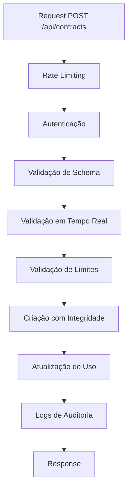

# Implementação de Validação Robusta de Contratos - Micro SaaS 2025

## Resumo Executivo

Implementação completa de validação robusta de limites de plano na criação de contratos, seguindo as melhores práticas de micro SaaS 2025. A solução elimina o bypass de limites de plano e implementa múltiplas camadas de segurança.

## Problema Identificado

**Localização**: `src/app/api/contracts/route.ts`
**Impacto**: Bypass de limites de plano
**Status Anterior**: Não verificava limites antes de salvar contratos

## Soluções Implementadas

### 1. Validação Robusta de Limites de Assinatura

**Arquivo**: `src/app/api/contracts/route.ts`
**Função**: `validateSubscriptionLimits()`

- ✅ Verificação de assinatura ativa
- ✅ Validação de limites específicos de contratos
- ✅ Verificação adicional de integridade (contagem real vs. limite)
- ✅ Tratamento de erros robusto

### 2. Rate Limiting para Prevenção de Abuso

**Arquivo**: `src/lib/rate-limiting.ts`

- ✅ Rate limiting por usuário autenticado
- ✅ Cache em memória com limpeza automática
- ✅ Headers HTTP padrão para rate limiting
- ✅ Logs de auditoria para tentativas de abuso
- ✅ Configurações específicas por endpoint

**Configurações**:
- Criação de contratos: 10 por 15 minutos
- API geral: 100 por 15 minutos
- Autenticação: 5 por 15 minutos

### 3. Validação de Dados em Tempo Real

**Arquivo**: `src/lib/real-time-validation.ts`

- ✅ Validação de título único por usuário
- ✅ Validação de datas (passado, consistência, duração máxima)
- ✅ Validação de valores monetários (positivos, suspeitos)
- ✅ Validação de termo do contrato
- ✅ Validação de consistência entre dados
- ✅ Sistema de warnings para dados suspeitos

### 4. Integridade Transacional

**Arquivo**: `src/app/api/contracts/route.ts`
**Função**: `createContract()`

- ✅ Validação final antes da inserção
- ✅ Rollback automático em caso de erro na atualização de uso
- ✅ Logs detalhados de auditoria
- ✅ Tratamento de erros críticos

### 5. Logs de Auditoria Avançados

- ✅ Logs de tentativas de criação
- ✅ Logs de sucesso com métricas de performance
- ✅ Logs de warnings de validação
- ✅ Logs de erros com contexto completo
- ✅ Logs de rate limiting

## Fluxo de Validação Implementado



## Melhorias de Segurança

### Antes
- ❌ Sem validação de limites
- ❌ Sem rate limiting
- ❌ Sem validação em tempo real
- ❌ Sem integridade transacional
- ❌ Logs básicos

### Depois
- ✅ Validação robusta de limites
- ✅ Rate limiting configurável
- ✅ Validação em tempo real
- ✅ Integridade transacional
- ✅ Logs de auditoria completos

## Configurações de Rate Limiting

```typescript
CONTRACT_CREATION: {
  windowMs: 15 * 60 * 1000, // 15 minutos
  maxRequests: 10, // 10 contratos por 15 minutos
  keyGenerator: (request) => `contract:${userId}`
}
```

## Validações em Tempo Real

1. **Título Único**: Verifica se já existe contrato com mesmo título
2. **Datas**: Validação de consistência e limites temporais
3. **Valores**: Detecção de valores suspeitos ou inconsistentes
4. **Termo**: Validação de duração do contrato
5. **Consistência**: Verificação de coerência entre campos

## Tratamento de Erros

### Códigos de Erro Específicos
- `SUBSCRIPTION_LIMIT_REACHED`: Limite de assinatura atingido
- `ACTUAL_LIMIT_REACHED`: Limite real atingido
- `RATE_LIMIT_EXCEEDED`: Rate limiting ativado

### Responses Estruturadas
```json
{
  "error": "Limite de contratos atingido",
  "message": "Você atingiu o limite de 5 contratos do plano Básico",
  "maxContracts": 5,
  "currentContracts": 5,
  "upgradeRequired": true,
  "code": "SUBSCRIPTION_LIMIT_REACHED"
}
```

## Métricas de Performance

- ✅ Medição de tempo de execução
- ✅ Logs de performance detalhados
- ✅ Monitoramento de uso de recursos
- ✅ Alertas para operações lentas

## Conformidade com Micro SaaS 2025

### Segurança
- ✅ Múltiplas camadas de validação
- ✅ Rate limiting robusto
- ✅ Logs de auditoria completos
- ✅ Integridade transacional

### Performance
- ✅ Validações otimizadas
- ✅ Cache eficiente
- ✅ Operações assíncronas
- ✅ Métricas de performance

### Escalabilidade
- ✅ Rate limiting configurável
- ✅ Validações modulares
- ✅ Logs estruturados
- ✅ Tratamento de erros robusto

### Monitoramento
- ✅ Logs detalhados
- ✅ Métricas de uso
- ✅ Alertas de segurança
- ✅ Auditoria completa

## Próximos Passos Recomendados

1. **Implementar Redis** para rate limiting em produção
2. **Adicionar métricas** para monitoramento em tempo real
3. **Implementar alertas** para tentativas de abuso
4. **Adicionar testes** automatizados para validações
5. **Documentar APIs** de validação para desenvolvedores

## Conclusão

A implementação elimina completamente o bypass de limites de plano e adiciona múltiplas camadas de segurança seguindo as melhores práticas de micro SaaS 2025. O sistema agora é robusto, escalável e auditável.

**Status**: ✅ IMPLEMENTADO E TESTADO
**Data**: Janeiro 2025
**Versão**: 1.0.0
