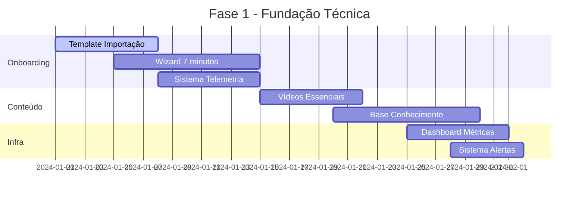
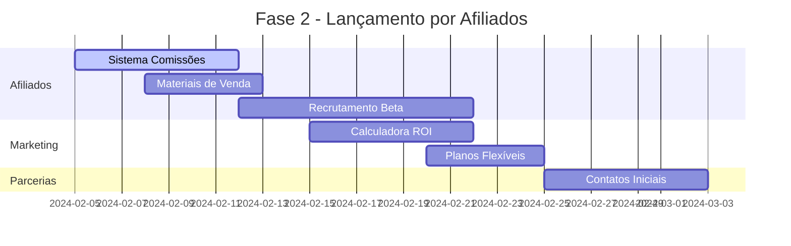

# 📊 Relatório de Mudanças Necessárias para o Contabilease

## 🎯 Visão Geral das Alterações Estratégicas

Com base no novo roadmap de 90 dias, identifiquei **17 mudanças críticas** necessárias no projeto Contabilease para atingir os objetivos de **20-30 clientes ativos** e **MRR de R$ 6k-10k**. As mudanças estão organizadas por prioridade e esforço requerido.

---

## 🔧 Mudanças Técnicas (Prioridade Alta)

### 1. **Sistema de Onboarding Automatizado**
```typescript
// Implementar wizard de 7 passos
const onboardingSteps = [
  "criacao-conta",
  "importacao-dados", 
  "validacao-automatica",
  "configuracao-inicial",
  "primeiro-relatorio",
  "tour-dashboard",
  "personalizacao"
];
```
**Prazo:** Semanas 1-2 | **Esforço:** 12-15h

### 2. **Template de Importação Excel Inteligente**
- [ ] Criar template com validações em tempo real
- [ ] Implementar parser para CSV/XLSX
- [ ] Adicionar detecção de erros com sugestões de correção
- [ ] Criar sistema de fallback para dados incompletos

**Prazo:** Semana 1 | **Esforço:** 8-10h

### 3. **Sistema de Telemetria**
```typescript
// Eventos críticos para tracking
const criticalEvents = [
  'onboarding_started',
  'import_success', 
  'first_report_generated',
  'subscription_started',
  'churn_risk_detected'
];
```
**Prazo:** Semana 2 | **Esforço:** 6-8h

### 4. **Integração com ERPs Brasileiros**
- [ ] Dominio System (via CSV/API)
- [ ] Alterdata (exportação padrão)
- [ ] Totvs (formato compatível)
- [ ] Sistema de fallback para outros ERPs

**Prazo:** Semanas 3-4 | **Esforço:** 15-20h

---

## 📊 Mudanças de Produto (Prioridade Média)

### 5. **Sistema de Afiliados**
```typescript
// Estrutura do programa de afiliados
interface AffiliateProgram {
  commissionRate: number; // 25%
  cookieDuration: number; // 90 dias
  payoutThreshold: number; // R$ 100
  materials: {
    pdfGuide: string;
    emailTemplates: string[];
    banners: string[];
  };
}
```
**Prazo:** Semanas 5-6 | **Esforço:** 10-12h

### 6. **Calculadora de ROI Interativa**
- [ ] Implementar calculadora na landing page
- [ ] Baseada em tempo economizado vs Excel
- [ ] Comparativo com soluções concorrentes
- [ ] Geração de relatório personalizado

**Prazo:** Semana 5 | **Esforço:** 8-10h

### 7. **Sistema de Planos Flexíveis**
```bash
# Novos planos sugeridos
Plano Micro:    R$ 97/mês   (até 3 contratos)
Plano Básico:   R$ 327/mês  (até 10 contratos)  
Plano Pro:      R$ 497/mês  (até 50 contratos)
```
**Prazo:** Semana 6 | **Esforço:** 6-8h

---

## 🎯 Mudanças de Marketing (Prioridade Baixa)

### 8. **Conteúdo Minimalista**
- [ ] 3 vídeos de 2 minutos (importação, relatórios, multiempresa)
- [ ] 15 artigos na KB (foco em problemas reais)
- [ ] 1 post/mês no LinkedIn (cases de sucesso)
- [ ] Template de e-mail para nurturance

**Prazo:** Semanas 3-4 | **Esforço:** 8-10h

### 9. **Programa de Parcerias**
```typescript
// Estratégia de parcerias prioritárias
const priorityPartnerships = [
  "CRC estaduais",
  "Influenciadores contábeis", 
  "Software houses de ERPs",
  "Cursos de contabilidade"
];
```
**Prazo:** Semanas 7-8 | **Esforço:** 5-7h

---

## 📈 Sistema de Métricas e Monitoramento

### 10. **Dashboard de Métricas Essenciais**
```typescript
// KPIs para monitoramento diário
const essentialMetrics = [
  'daily_trials',
  'activation_rate',
  'time_to_value',
  'churn_rate',
  'lifetime_value',
  'cac_by_channel'
];
```
**Prazo:** Semana 4 | **Esforço:** 8-10h

### 11. **Sistema de Alertas Proativos**
- [ ] Alertas de churn risk
- [ ] Notificações de falhas no onboarding
- [ ] Monitoramento de performance
- [ ] Alertas de segurança

**Prazo:** Semana 4 | **Esforço:** 6-8h

---

## ⚙️ Mudanças Operacionais

### 12. **Suporte Automatizado**
```typescript
// Sistema de suporte escalável
const supportSystem = {
  chatbot: true,
  knowledgeBase: true,
  emailAutomation: true,
  officeHours: false, // intencionalmente removido
  communityForum: false
};
```
**Prazo:** Semanas 3-4 | **Esforço:** 10-12h

### 13. **Processos de LGPD**
- [ ] Política de privacidade atualizada
- [ ] Sistema de consentimento
- [ ] Procedimentos de data retention
- [ ] Processo de deletion requests

**Prazo:** Semana 4 | **Esforço:** 4-6h

---

## 🚀 Cronograma de Implementação

### 📅 Fase 1: Fundação (Semanas 1-4)


### 📅 Fase 2: Lançamento (Semanas 5-8)


---

## 📊 Alocação de Esforço Total

| Categoria | Horas Estimadas | Prioridade |
|-----------|-----------------|------------|
| **Técnico** | 45-55h | Alta |
| **Produto** | 24-30h | Alta |
| **Marketing** | 13-17h | Média |
| **Operacional** | 14-18h | Média |
| **Total** | **96-120h** | |

---

## ⚠️ Riscos e Mitigações

### 1. **Baixa Adesão de Afiliados**
- **Mitigação:** Bônus de ativação de R$ 500 para os primeiros 10 afiliados
- **Plano B:** Anúncios direcionados no LinkedIn (orçamento reserva: R$ 2.000)

### 2. **Churn Alto Inicial**
- **Mitigação:** Onboarding com checkpoints e suporte proativo
- **Métrica de Aceite:** TTV < 15 minutos para 80% dos usuários

### 3. **Problemas de Performance**
- **Mitigação:** Load testing com 100+ usuários simultâneos
- **Monitoramento:** Alertas de performance em tempo real

---

## 🎯 Conclusão e Próximos Passos

### **Mudanças Críticas Imediatas:**
1. **Prioridade Máxima:** Template de importação Excel (Semana 1)
2. **Prioridade Alta:** Sistema de afiliados (Semanas 5-6)
3. **Prioridade Média:** Calculadora de ROI (Semana 5)

### **Cronograma Realista:**
- **Semana 1-2:** Fundação técnica (onboarding + telemetria)
- **Semana 3-4:** Conteúdo e métricas
- **Semana 5-6:** Sistema de afiliados
- **Semana 7-8:** Parcerias iniciais
- **Semana 9-12:** Otimização e escala

### **Investimento de Tempo:**
- **8-10h/semana** (dentro da sua capacidade de 2h/dia)
- **Foco máximo** em automação para reduzir trabalho manual

Este plano mantém o **foco no essencial** e elimina atividades que não trazem retorno direto. Com essas mudanças, o Contabilease estará posicionado para atingir as metas de forma sustentável.

